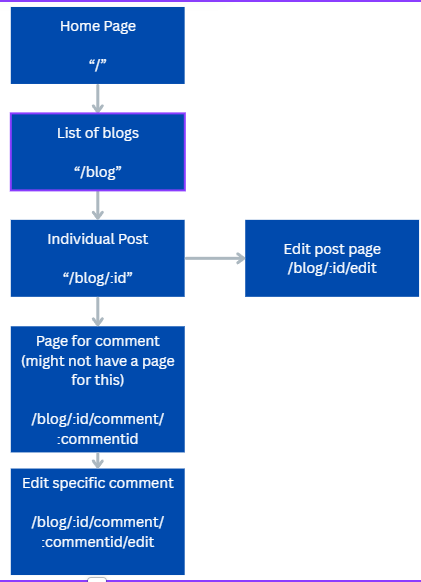

## Requirements

🎯✅ Display all posts on the page, with an option to sort them in ascending or descending order.

- Posts can be sorted Newest, Oldest, Ascending, Descending

🎯✅ Create a SQL schema for a posts table and a comments table, with the comments being connected to the posts table with a foreign key.

- Posts are separated from the comments and a foreign key is connecting them.

🎯✅ Create a delete button on posts that allows users to delete the post from the database.

- Comments can be deleted as I didn't want the posts themselves to be deleted.

🎯✅ Create a form which saves comments to a dedicated comments table, with the comments being connected to the posts table with a foreign key.

- Comments form in effect that adds comments to a dedicated comments table

🎯✅ Allow users to comment on individual posts in their dynamic routes. Comments should be associated with posts, and have a dynamic route (e.g. /posts/:postid).

- Dynamic routes set up for user comments and the comments link to the post

🎯✅ Add a redirect when a user creates a post to redirect them to the posts page.

- Redirect in effect when a new post is created or when a post/comment is edited etc

## Stretch

🏹✅ Implement a select input (or similar mechanism) that allows users to categorise posts during creation, storing them in their own table in the database. Ensure appropriate routing for categories, with endpoints such as /categories and /categories/:id to enable users to browse and interact with posts by category.

- Categories can be selected when a post is being added to allow categorisation of the post. Categories are pulled from a database table

🏹✅ Create an edit functionality accessible via /posts/:id/edit, which pre-fills a form for post data. Create a working PUT route to update the post in the database.

- Posts can be edited and the data is pre-filled using the defaultvalue attribute. route is appropriate to the action.

🏹✅ Develop an edit comment feature accessible via /posts/:id/comments/:id/edit, which pre-fills a form for comment data. Create a working PUT route to update the comment in the database.

- Comments can also be edited and the data is pre-filled the same as the posts editing route. route is also appropriate to the action

## Planning Wireframes

## Reflection

This weeks assignment felt quite straight forward which is a testament to a couple of things. Firstly, how far i've come in this journey of learning to code, and secondly, how simply NextJS seems to be as a framework to work with. NextJS does a lot to make achieving tasks convenient such as being able to query my database directly within my components instead of creating separate endpoints and fetching them from the client.

I used this project as an opportunity to practice with various methods of styling. After having learned about modules this week, I used modules to style various elements, as well as tailwind for further styling. There were many opportunities where I could have simplified the styling by putting styles in my globals and reusing the classnames, but as I wanted to practice further with styling, where I previously styled a button with a module style, I restyled with tailwind etc.

In an ideal world, the editing of the posts and edit/deletion of comments would be authenticated to the site admin or specific user so nobody could edit the posts and comments, however with the tools we have and for the sakes of the goals of the assignment, all comments can be edited and deleted, and the posts can be edited.

I added Home and Contact to the navigation to show some styling that I have been playing with, but the pages are not populated with content as I didn't have the time to do it, however these pages are all additional to the requirements of the assignment.

One aspect of NextJS that I don't like is how easy it is to get lost in your page.js files. As they're all called the same, sometimes its confusing when working with many nested folders.

For this assignment one aspect that I could have done a lot better with is separating my code into components. I was thinking of ways I could reuse the same form component by simply changing the query when the form is submitted using props. Going forward this will be an area that i'll be more cognisant of to make my code more DRY.
